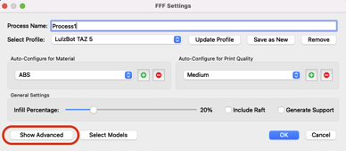
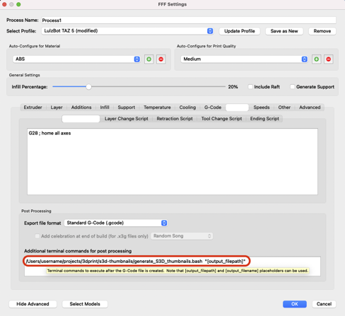
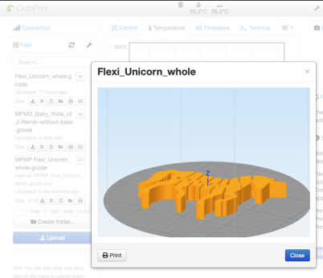
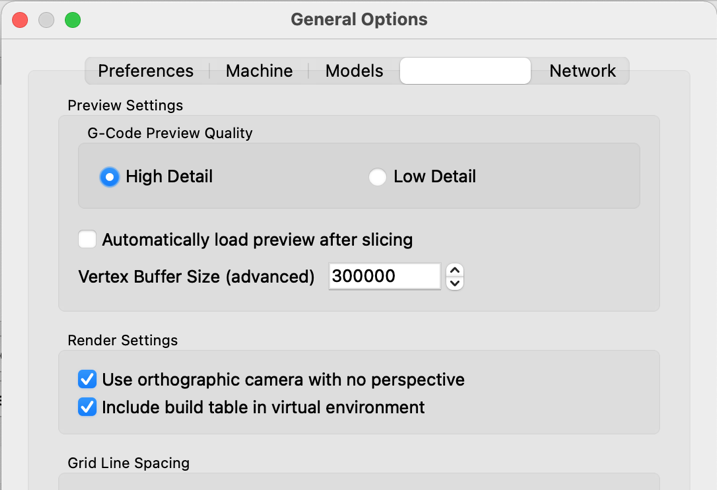

# Insert gcode preview thumbnails for Simplify3D on macOS

Tested with [Slicer Thumbnails](https://plugins.octoprint.org/plugins/prusaslicerthumbnails/) plugin for OctoPrint.

Tested on **`Simplify3D.app`** `4.1.2` in macOS Big Sur on both Intel and Apple Silicon

## Install

1. Install dependencies. Use macOS [Homebrew](https://brew.sh/).

    ```shell
    brew install imagemagick
    brew install smokris/getwindowid/getwindowid
    ```

1. Clone this repo somewhere in your macOS home directory.

    ```shell
    mkdir -p ~/projects/3dprint
    cd ~/projects/3dprint
    git clone https://github.com/idcrook/s3d-thumbnail-generator-macos.git s3d-thumbnails
    ```

1. Customize the included `generate_S3D_thumbnails.bash` script

   - Customize any paths (most should be fine as-is)
   - May need to iterate on the cropping image dimensions and proportions to match your window layout and preferences.

1. Add script invocation in Simplify 3D gcode post-processing

    ```shell
    /Users/%%USERNAME%%/projects/3dprint/s3d-thumbnails/generate_S3D_thumbnails.bash "[output_filepath]"
    ```

     - This is added in `Additional terminal commands for post processing` in the *Scripts* tab in *Process* settings, e.g.

     
     
     

1. Now when you save the `.gcode` file in **`Simplify3D.app`**, thumbnails get embedded directly.

**IMPORTANT**: For recent macOS, in *System Preferences* in the *Security and Privacy* preferences, in the *Privacy* tab, you will have to enable **Screen Recording** (and possibly **Accessibility**) permissions for **`Simplify3D.app`**

   - This is so the post-processing script can automatically screen capture the Simplify3D app window


 - The preview thumbnail is obtained directly from the Simplify3D application window.


With [Slicer Thumbnails](https://plugins.octoprint.org/plugins/prusaslicerthumbnails/) plugin for Octoprint enabled, the thumbnail can be viewed from web interface.




## Additional Settings

### Use Sliced preview or normal view

The thumbnail is captured from the Simplify3D application window when the sliced .gcode file **is saved**.

If you prefer the non-sliced preview version, in Application *Preferences* in the *Visualization* tab, uncheck

- [ ] "Automatically load preview after slicing"



### Customize crop size and position

The image crop and dimension settings may be unique to the preview type and your macOS desktop setup.

These are adjustable in the script. Look for the in the bash script for the section starting at the line `# Position the crop bounding box`

## SEE ALSO

  - https://plugins.octoprint.org/plugins/prusaslicerthumbnails/

      - https://github.com/boweeble/s3d-thumbnail-generator
      - https://github.com/NotExpectedYet/s3d-thumbnail-generator
