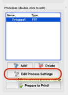
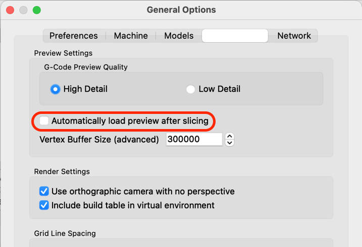

# s3d-thumbnail-generator-macos

Creates gcode thumbnails from Simplify3D within macOS environment.

Tested with [Slicer Thumbnails](https://plugins.octoprint.org/plugins/prusaslicerthumbnails/) plugin for OctoPrint.

## Install

1. Install dependencies. Use Homebrew.

    ```shell
    brew install imagemagick
    brew install smokris/getwindowid/getwindowid
    ```

1. Clone this repo somewhere in your macOS home directory.

    ```shell
    mkdir -p ~/projects/3dprint
    cd ~/projects/3dprint
    git clone https://github.com/idcrook/s3d-thumbnail-generator-macos.git s3d-thumbnails
    ```

1. In the included `generate_S3D_thumbnails.bash` script
   - Customize any paths (most should be fine as-is)
   - May have to iterate on the image dimensions and proportions to match your window layout and preferences.

1. Add script invocation in Simplify 3D gcode post-processing

    ```shell
    /Users/username/projects/3dprint/s3d-thumbnails/generate_S3D_thumbnails.bash "[output_filepath]"
    ```

     - This is added in `Additional terminal commands for post processing` in the *Scripts* tab in *Process* settings, e.g.

     

     

     


Now when you save the `.gcode` file in **`Simplify3D.app`**, thumbnails get embedded directly.

 - The preview thumbnail is obtained directly from the Simplify3D application window.
 - For recent macOS, in *System Preferences* and in the *Security and Privacy* preferences, in the *Privacy* tab, you will have to enable **Screen Recording** (and possibly **Accessibility**) permissions for **`Simplify3D.app`**
   - This is so the post-processing script can automatically screen capture the Simplify3D app window


## Additional Settings


### Use Sliced preview or normal view

In Application **Preferences** in the *Visualization* tab, uncheck

- [ ] "Automatically load preview after slicing"

if you prefer the non-sliced preview version.  The image crop and dimension settings may be unique to the preview type and your macOS desktop setup.




## SEE ALSO

  - https://plugins.octoprint.org/plugins/prusaslicerthumbnails/

      - https://github.com/boweeble/s3d-thumbnail-generator
      - https://github.com/NotExpectedYet/s3d-thumbnail-generator
